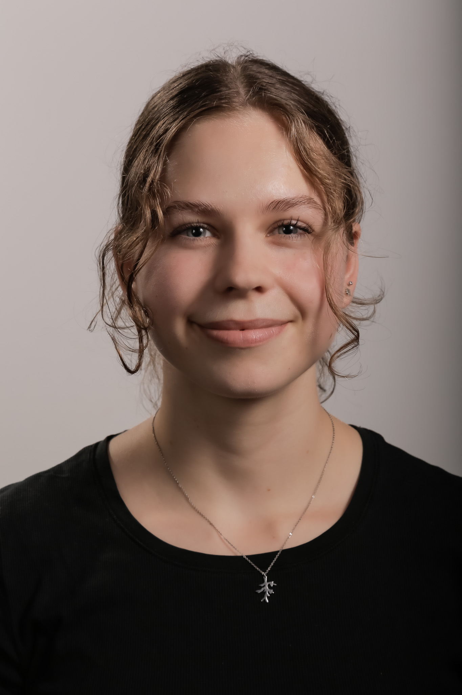
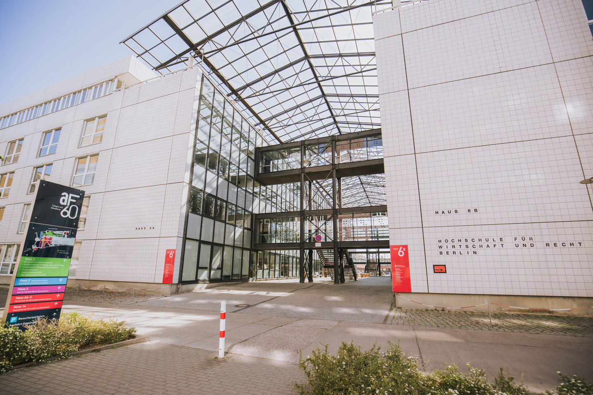
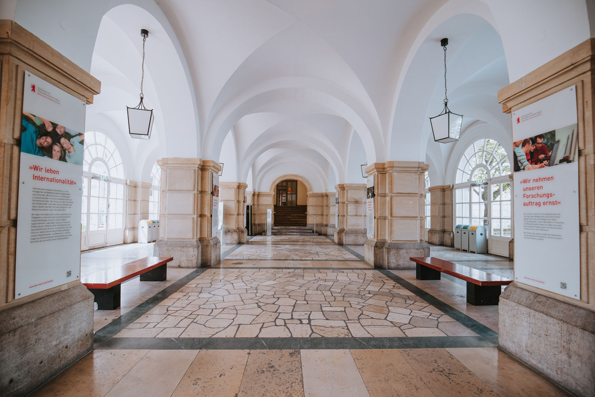

---
---

# Hi, I'm Carina

Master's student at HWR Berlin · Berlin native · Business Informatics

I'm 23 years old. I was born in Berlin, grew up in Hennigsdorf just outside the city, and went to high school in Köpenick. I then completed a dual Bachelor's degree in Business Informatics at HWR in Lichtenberg, in cooperation with BEW, a district heating company that used to be part of Vattenfall. After a one-week break, I'm now starting my Master's with all of you.

## My path to HWR

**Childhood – Where it started** (Hennigsdorf)  
Born in Berlin and raised in Hennigsdorf, just outside the city.

**High school** (Köpenick, Berlin)
I went to high school in Köpenick.

**3 years – Dual Bachelor's degree** (HWR Berlin, Lichtenberg)  
I studied Business Informatics and alternated between university and work every three months, in cooperation with BEW, a district heating company that used to be part of Vattenfall.

**3 years – Dual Bachelor's degree** (BEW Offices, Südkreuz)  

**Now – Master's at HWR** (HWR Berlin, Schöneberg)  
After a one-week break I'm starting my Master's, aiming to learn data analytics, process optimisation and automation.

**Now – Parttime work at BEW (HR Services)**

## Where I've been

<iframe src="map (5).html" width="100%" height="450" style="border:0"></iframe>

## Beyond the classroom

- **Hobbies:** Reading, plant care, drawing, yoga and travelling.
- **Languages:** German, English and Spanish (545-day Duolingo streak and counting).
- **What I hope to learn here:** Data analytics, process optimisation and automation.
- **How to reach me:** WhatsApp or [LinkedIn](https://www.linkedin.com/in/carina-gowitzke-835247320/).
